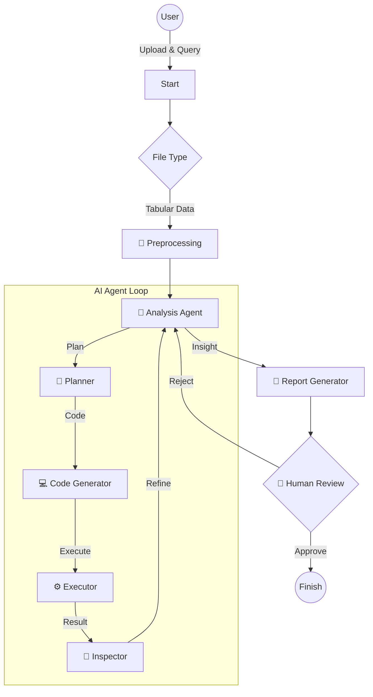

# 🤖 AIplus MultiAgent - 데이터 분석 AI (Streamlit 배포용)

이 저장소는 **AI 데이터 분석 에이전트 서비스**의 배포 전용 저장소입니다.  
사용자가 업로드한 데이터를 분석하고, 시각화하며, 보고서를 작성해주는 멀티 에이전트 시스템입니다.

---

## 🔗 실 사용 배포 주소
배포가 완료되면 아래 링크에서 바로 사용해볼 수 있습니다.
> **[👉 앱 바로가기 (클릭)](https://marketing-auto.streamlit.app/)**  

---

## 📊 분석 결과 예시
AI가 생성한 분석 차트와 인사이트의 예시입니다.

*(실제 분석 과정에서 생성된 차트 이미지입니다)*

---

## 🛠️ 주요 기능 및 사용법 (User Manual)

### 1. 🚀 시작하기 (Getting Started)
1. 왼쪽 사이드바에서 **CSV 파일**을 업로드합니다.
2. 분석하고 싶은 내용을 **자연어 질문**으로 입력합니다.
   - 예: *"월별 매출 추이를 보여줘"*, *"ROAS가 높은 광고 캠페인은 무엇이야?"*
3. **분석 시작** 버튼을 클릭합니다.

### 2. 🧠 멀티 에이전트 프로세스 (Workflow)
시스템은 내부적으로 여러 AI 에이전트가 협업하여 결과를 도출합니다.



### 3. 📈 시각화 및 리포트
- **Interactive Charts**: Plotly/Matplotlib을 이용한 다양한 차트 제공.
- **Business Insight**: 데이터 수치를 기반으로 비즈니스 액션 아이템 제안.
- **Download**: PDF, PPTX, HTML 등 다양한 포맷으로 결과물 다운로드 가능.

---

## 📦 기술 스택 (Tech Stack)

이 프로젝트는 최신 AI 및 웹 기술을 사용하여 구축되었습니다.

### 1. Web & UI
| 패키지 | 버전 | 설명 |
| :--- | :--- | :--- |
| **Streamlit** | `1.32+` | 직관적인 웹 인터페이스(UI) 구축 |

### 2. AI Agent Framework
| 패키지 | 설명 |
| :--- | :--- |
| **LangGraph** | 에이전트 간의 흐름(State) 관리 및 제어 |
| **LangChain** | LLM(GPT-4o) 컴포넌트 연결 |
| **OpenAI API** | 추론 및 코드 생성을 위한 LLM 엔진 |

### 2. 데이터 분석 및 시각화
| 패키지 | 설명 |
| :--- | :--- |
| **Pandas** | 데이터 전처리 및 분석 |
| **Matplotlib** | 정적 차트 생성 |
| **Seaborn** | 통계적 데이터 시각화 |
| **Koreanize-matplotlib** | 한글 폰트 지원 (필수) |

### 3. 시스템 및 유틸리티
| 패키지 | 설명 |
| :--- | :--- |
| **Graphviz** | 워크플로우 시각화 도구 |
| **Fonts-nanum** | 리눅스(Streamlit Cloud) 환경 한글 폰트 |

---

## ☁️ 배포 환경 (Streamlit Cloud)

이 프로젝트는 **Streamlit Community Cloud**에 최적화되어 있습니다.

### 필수 설정 파일
- `packages.txt`: 리눅스 시스템 패키지 설치 목록입니다.
  - `graphviz`: 에이전트 그래프 시각화용
  - `fonts-nanum`: 한글 폰트 지원 (차트 깨짐 방지)
- `requirements.txt`: Python 라이브러리 의존성 목록입니다.

### 환경 변수 설정 (Secrets)
배포 시 Streamlit Cloud의 **Advanced Settings -> Secrets**에 다음 API 키를 등록해야 합니다.
```toml
OPENAI_API_KEY = "sk-..."
# (선택) LangSmith 추적용
LANGSMITH_API_KEY = "..."
```

---

## 📂 디렉토리 구조 (Directory Structure)
```
.
├── src/            
│   └── Orc_agent/   # AI 에이전트 핵심 로직
│       ├── Node/    # 각 단계별 노드 (Main, Sub)
│       └── Graph/   # LangGraph워크플로우 정의
├── webapp/         
│   ├── app.py       # Streamlit 웹 애플리케이션 메인
│   └── ...
├── assets/          # README용 이미지 리소스
├── requirements.txt # 파이썬 의존성 패키지
├── packages.txt     # 시스템 의존성 패키지 (한글폰트 등)
└── README.md        # 프로젝트 설명서
```

---

## 📜 라이선스 (License)
이 프로젝트는 **MIT License**를 따릅니다. 누구나 자유롭게 사용하고 수정할 수 있습니다.
